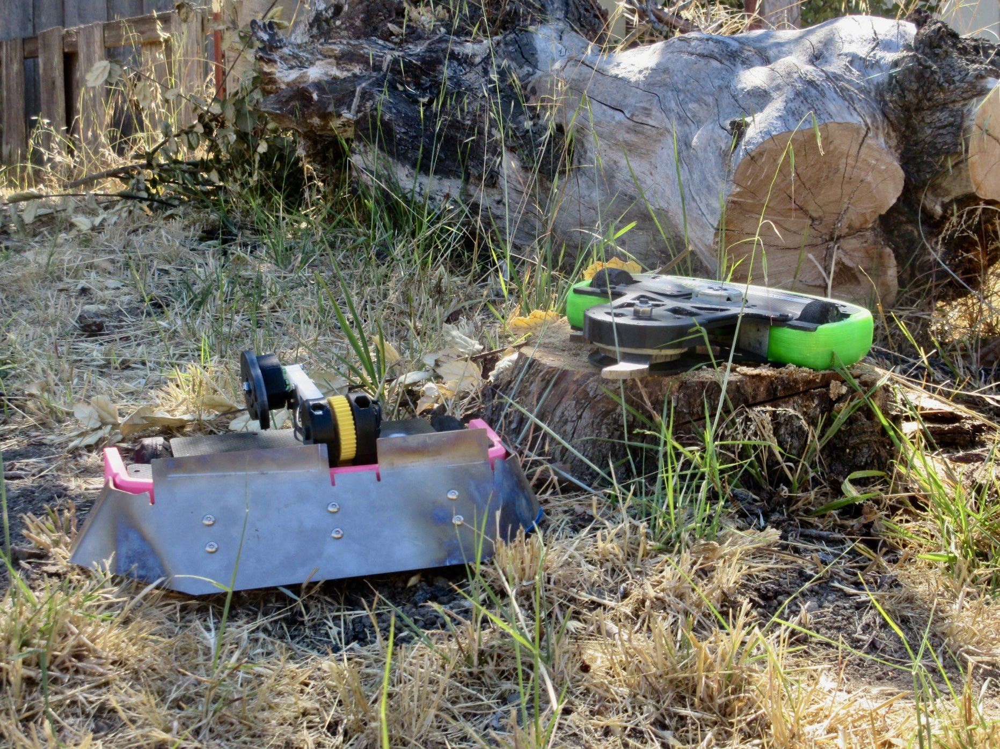

# UCSC Combat Robotics  

  

We are **UCSC Combat Robotics**, a student-led subteam of [Slugbotics](../index.md) founded in 2021. We design, build, and fight combat robots in tournaments both on and off campus.  

Our team focuses on **hands-on engineering**: CAD design, machining, wiring, assembly, and testing. No prior experience is needed—just an interest in building and competing.  

---

## What We Build  

- **3-lb beetleweights** (fast, destructive, and highly competitive)  
- **1-lb antweights** (intro builds for new members through our Plant Workshop)  

Robots use standard combat robotics systems:  
- Brushless and brushed motors  
- ESCs (electronic speed controllers)  
- LiPo batteries  
- Radio receivers & transmitters (no programming required)  
- Armor, weapon systems, and frames designed and manufactured by students  

---

## What We Do  

- **Build robots** from scratch each year  
- **Run workshops** to teach CAD, machining, soldering, and wiring  
- **Travel to competitions** across California  

---

## Our Robots  

  
*Our beetleweight combat robots, designed and built by UCSC students.*  

---

## How to Join  

1. **Come to an info session** at the start of the quarter  
2. **Join the Plant Workshop** to build your first 1-lb robot  
3. **Pick a subteam** (mechanical, electrical, or arena/tournament operations)  
4. **Help us compete** and improve our designs each quarter  

Follow us on [Instagram](https://www.instagram.com/ucsccombatrobotics/), join our [Discord](http://discord.slugbotics.com/), or check [Slugbotics.org](../index.md) for updates.  

---

👉 **Build. Battle. Repeat. Join UCSC Combat Robotics!**
