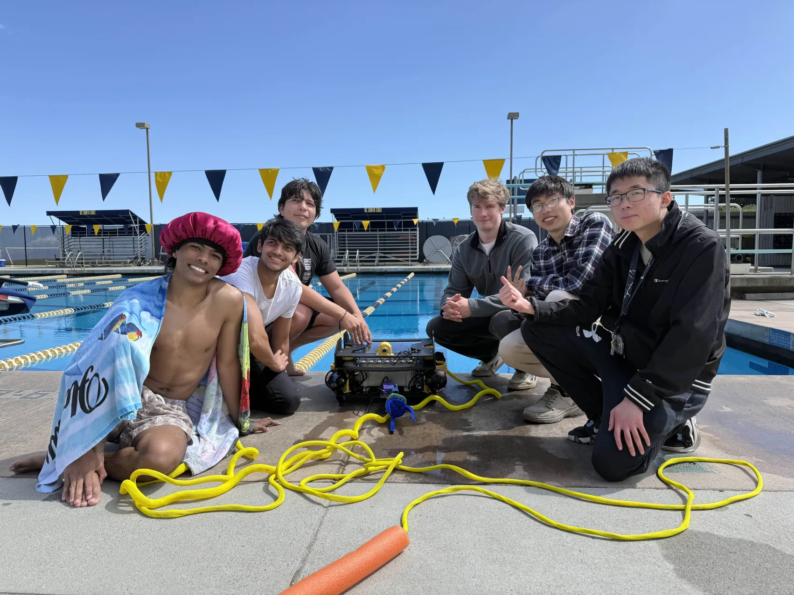
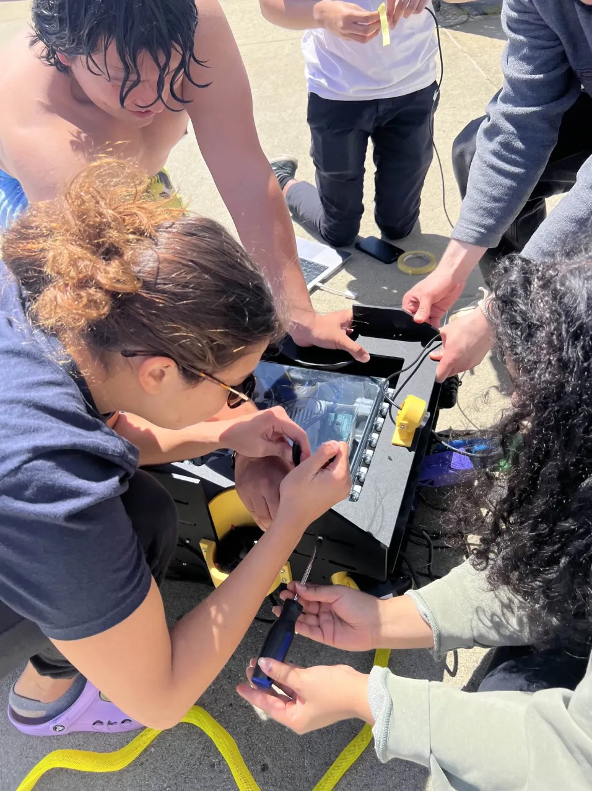
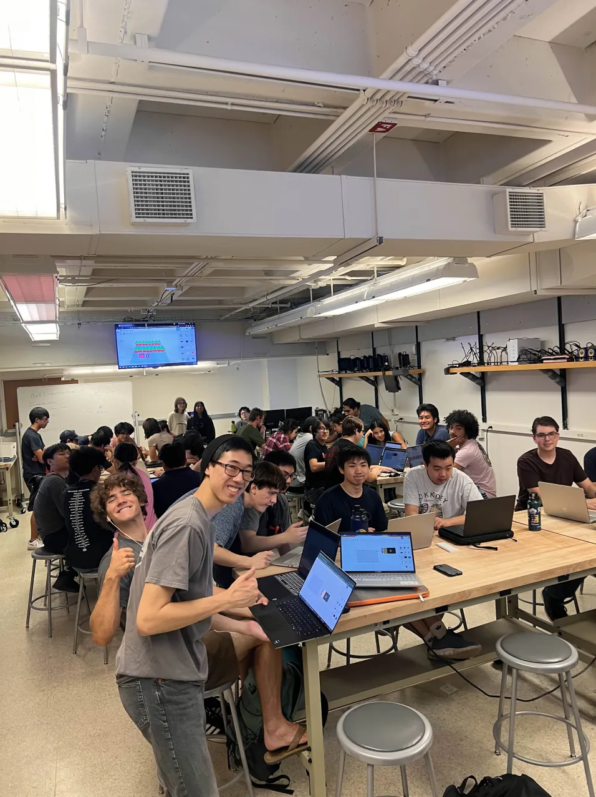
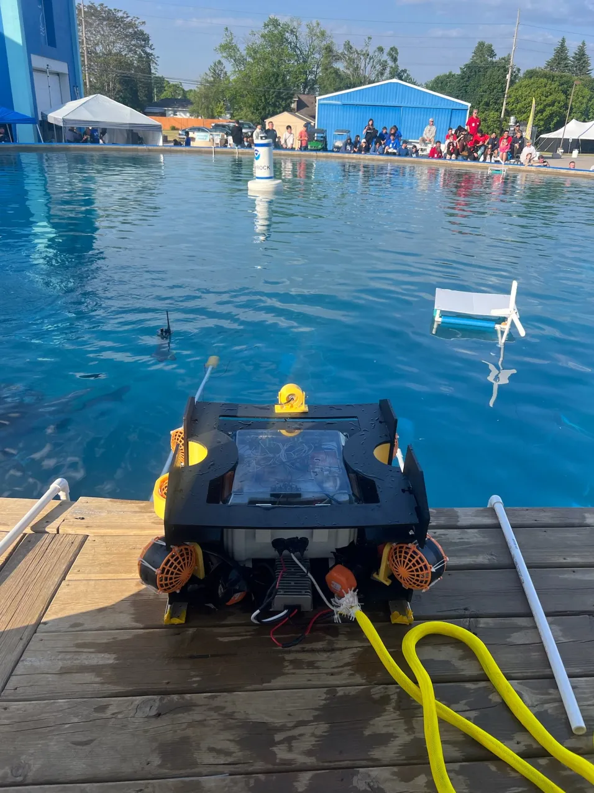

# Mate

The Mate project enables students to work on Marine robotics. Through building
an ROV (A remote operated underwater vehicle) and a FLOAT (A robotic buoy that
autonomously collects temperature and depth data). In this project, members are
driven to build an understanding of robotic systems, an understanding of how
these systems must interact with their environment, and an understanding of how
to develop the social collectivity necessary to develop these complex systems.
This project participates in the MATE ROV International Competition, an
underwater robotics competition that brings together students from all over the
world to exhibit their underwater robots.

- 
- 
- 
- 

