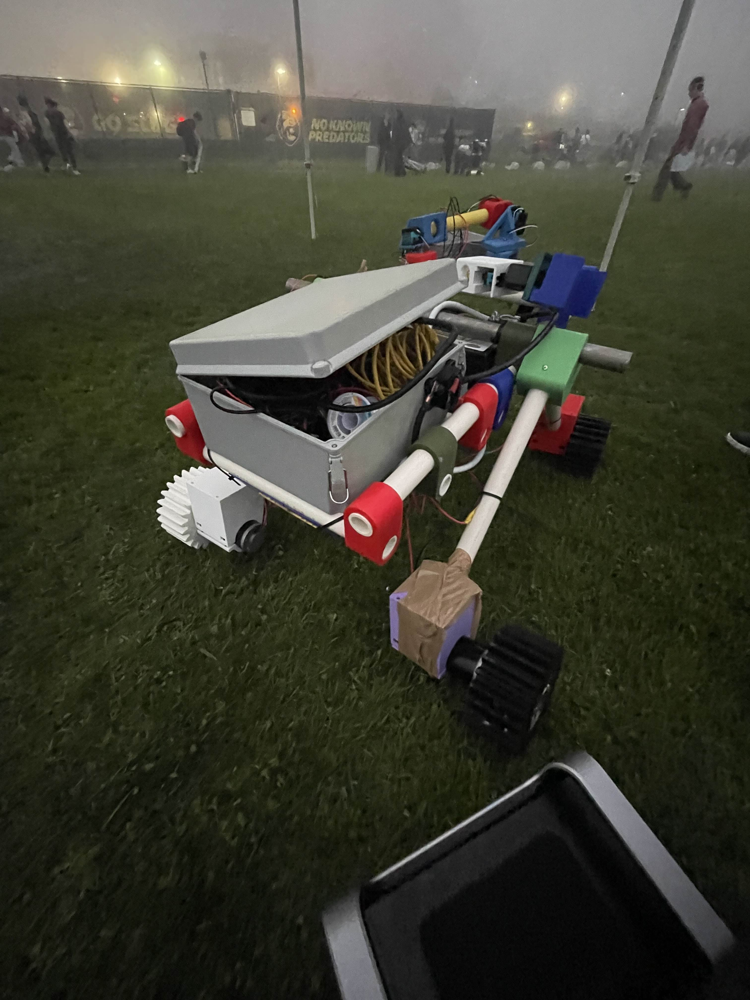
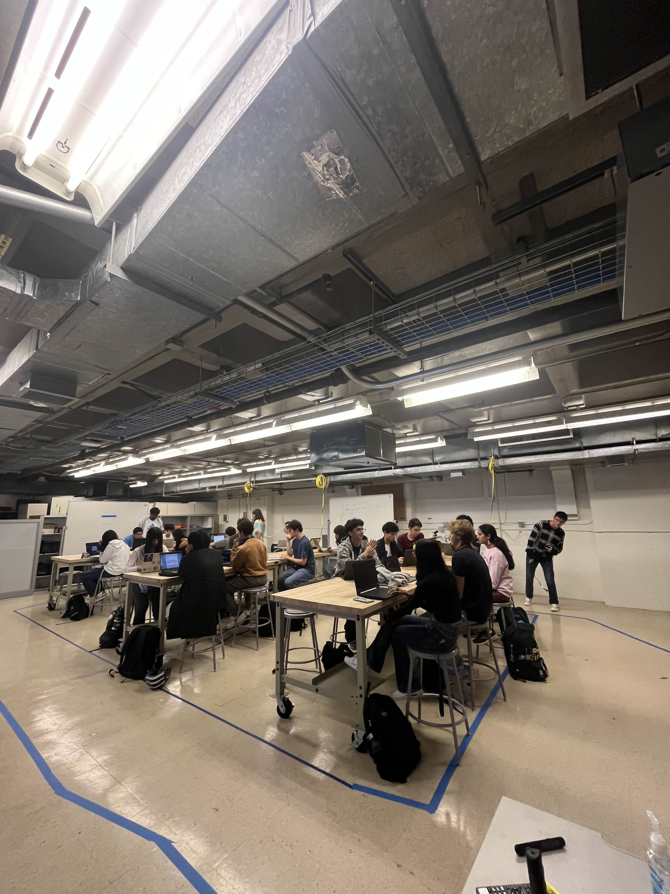
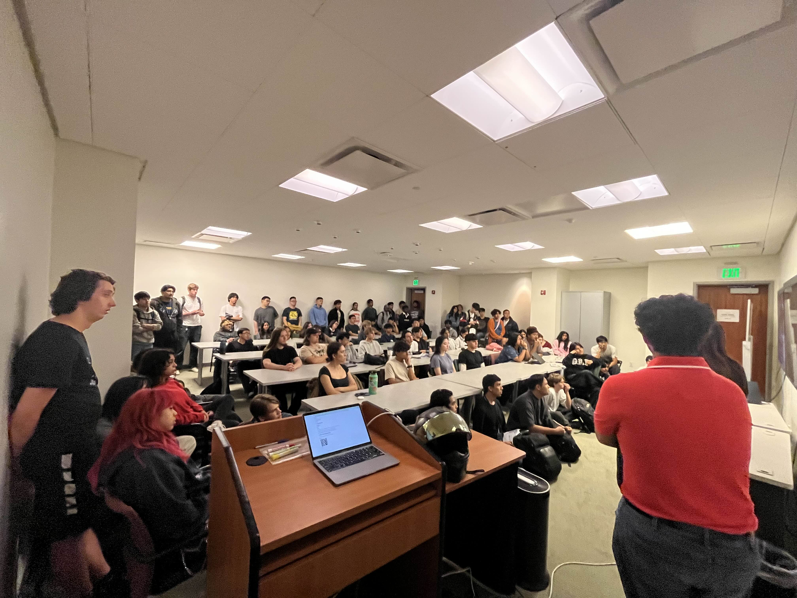
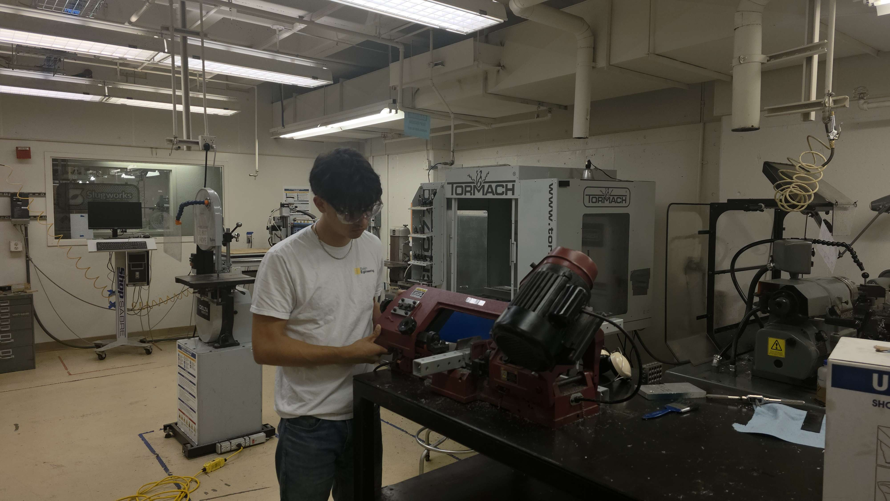
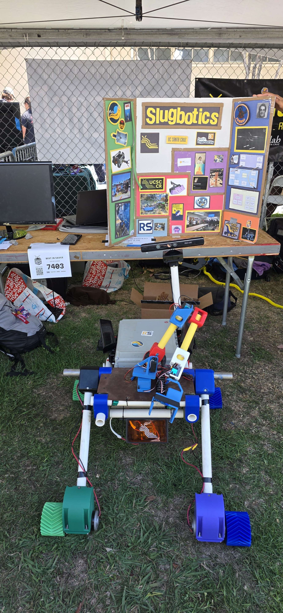

# Rover Team

## Overview

The Slugbotics Rover Team operates as a unified organization with two competitive branches: the **University Rover Challenge (URC)** and the **NASA Lunabotics Challenge**. While each competition has distinct engineering requirements, both share a foundation in mechanical design, electronics, and software systems. The team’s goal is to design, build, and field competition-ready robots capable of performing advanced tasks in mobility, excavation, and autonomous research.

By combining resources and expertise, the Rover Team fosters collaboration across disciplines—mechanical, electrical, software, documentation, and science—allowing members to develop the technical and teamwork skills essential to modern robotics.

## University Rover Challenge (URC)

The URC branch focuses on developing a Mars-analog rover capable of supporting astronauts and conducting scientific research in Mars-like environments. This rover is designed to navigate rough terrain, manipulate tools with a robotic arm, and autonomously perform science missions such as soil sample collection and analysis.

URC emphasizes mechanical reliability, electrical robustness, and software autonomy. Students on this team gain hands-on experience with CAD design, power management, computer vision, and science payload integration. The final goal is to field a fully capable rover that can perform mission-style tasks with precision, efficiency, and scientific accuracy at the international URC competition in Utah.

## NASA Lunabotics Challenge

The Lunabotics branch designs and builds a lunar excavation rover capable of digging and transporting simulated lunar regolith under conditions similar to the Moon’s surface. The focus is on structural design, safe electrical practices, and integrated autonomous operation.

Students gain practical experience in CAD, microcontroller programming, power systems, and excavation mechanism design. The challenge encourages innovative approaches to in-situation resource utilization, preparing students for careers in aerospace and planetary robotics.

## Team Goals and Development

The Rover Team strives for technical excellence, collaboration, and education. Members are cross-trained in CAD modeling, soldering, programming, and testing, allowing knowledge to flow across both competition branches. The team also promotes social cohesion through design reviews, workshops, and outreach events that strengthen the engineering community at UC Santa Cruz.

The long-term mission is not only to succeed in national competitions but also to establish a sustainable research and education platform that advances robotics development on campus.

## Images

- 
- 
- 
- 
- 

## Movement Video Demo

  <video width="80%" controls>
    <source src="../../assets/images/projects/rover/rover_demo.mp4" type="video/mp4">
    Your browser does not support the video tag.
  </video>

