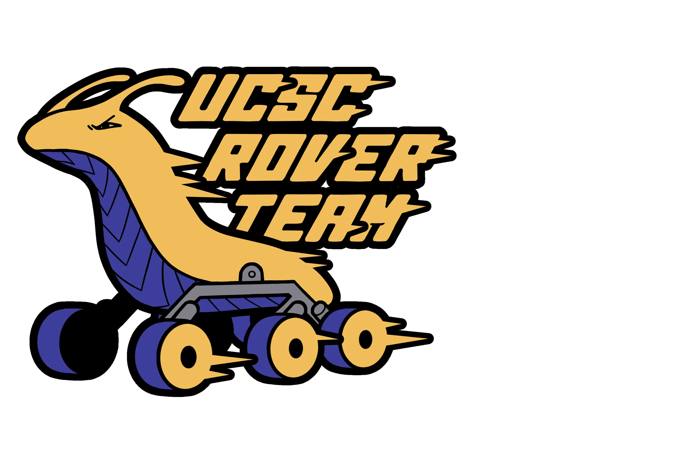
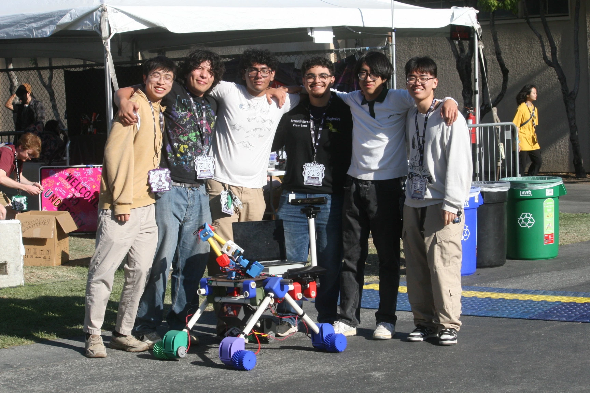
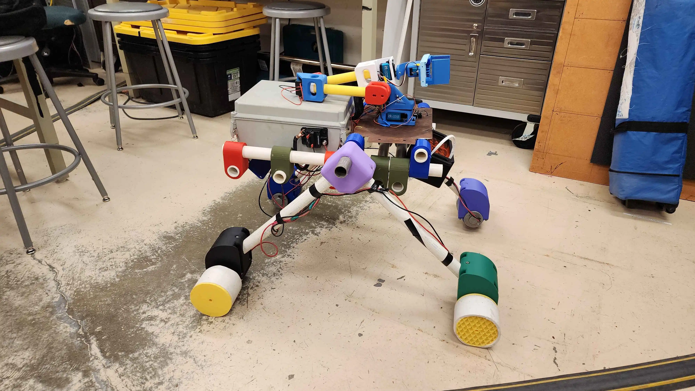
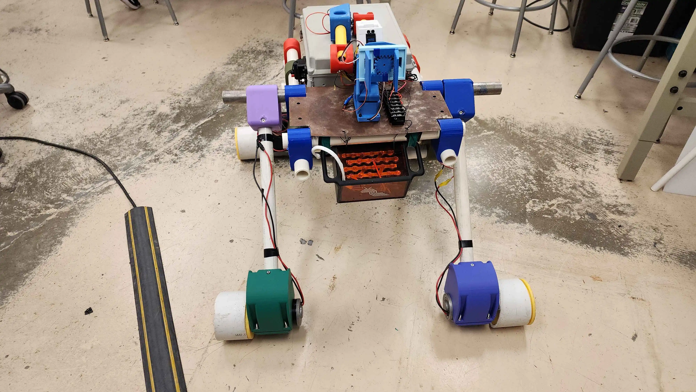

# Rover Team  

  

We are the **UCSC Rover Team**, a student-led subteam of [Slugbotics](../index.md) founded in 2024. Our mission is to design, build, and program a planetary rover capable of operating in Mars-like environments.  

We compete in the **University Rover Challenge (URC)** at the Mars Desert Research Station in Utah. The rover must complete complex missions such as soil sample collection, autonomous navigation, and equipment delivery — all while operating in rugged, off-road terrain at a far distance from our base station.  

---  

## What We Build  

- **All-terrain rover chassis** with modular suspension and drive systems  
- **Robotic manipulator arm** for payload tasks and sample retrieval  
- **Autonomous navigation stack** using ROS2, sensor fusion, and vision systems  
- **Power and communication systems** optimized for field operation  
- **Custom modular batteries** optimized for field hotswaps

Our rover integrates state-of-the-art robotics technologies:  
- High-torque motors and controllers  
- Stereo and depth cameras for computer vision  
- GPS, IMU, and vision systems for localization and mapping  
- Modular electronics for quick field repairs, upgrades, and hotswaps 

---  

## How We Work  

We are a **task-based team**:  
- We track all projects and tickets through **Notion**, making it easy for members to pick up tasks and contribute at their own pace  
- **Weekly team meetings** bring everyone together — mechanical, electrical, and software tasks are discussed in the same space so the entire team stays aligned and to ensure goals are met.  
- Members gain experience by completing tickets ranging from CAD design and machining to ROS2 development, wiring, and field testing 

This structure allows flexibility while ensuring steady progress toward URC.  

---  

## Our Current Rover  

Our proof-of-concept rover, **SCRAPPY**, was built to train members on rover design, electronics integration, and software development. It serves as a platform for testing locomotion, vision, and control pipelines before scaling to competition-level hardware. 
  

The next generation rover will be built from the ground up with **high quality components**, featuring upgraded drive modules, a six-DoF robotic arm, an integrated science module for soil and sample analysis, and advanced autonomy for real mission readiness.  

---  

## How to Join  

1. **Join our Discord** to connect with the team  
2. **Attend a meeting** to see current rover progress  
3. **Pick up a task in Notion** that interests you (mechanical, electrical, or software related)  
4. **Contribute to testing** as we prepare for URC 2026  
5. **Contribute to Sponsorship outreach** -- help us fund our 2026 season!! (This is the highest priority for the whole team)

We welcome students from all majors — from **Computer Science and Engineering** to **Earth & Planetary Sciences**. If you’re interested in robotics, science, autonomy, or space exploration, there’s a place for you here.  

Follow us on [Instagram](https://www.instagram.com/slugbotics/) and join our [Discord](http://discord.slugbotics.com/) to get started!  

---  

🚀 **Explore. Engineer. Compete. Join UCSC Rover Team!** 🚀  
